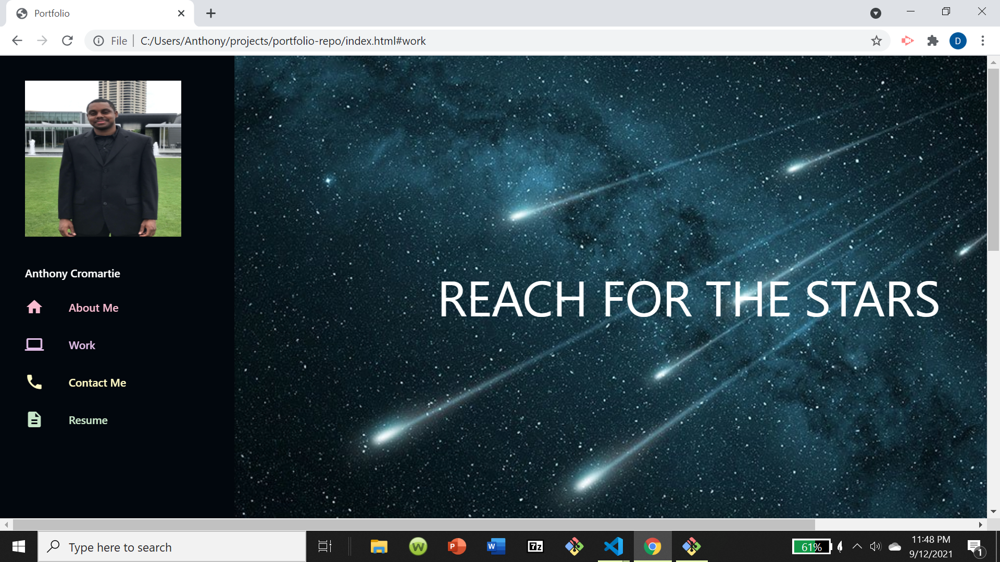
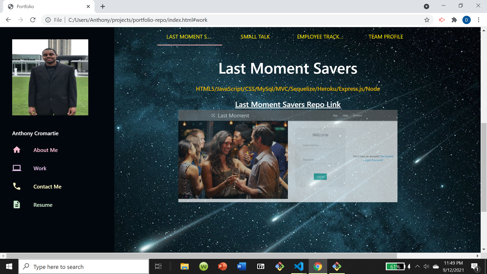

# Portfolio Project

## Description

My web portfolio of my web applications, resume and contact links

## ScreenShot

## Table of Contents

- [Technologies](#technologies)
- [Installation](#installation)
- [Usage](#usage)
- [License](#license)
- [Contributing](#contributing)
- [Tests](#tests)
- [Questions](#questions)

## Technologies

<ul>
    <li>HTML5</li>
    <li>CSS</li>
    <li>JavaScript</li>
    <li>Materalize</li>
</ul>

## Installation

There is no install instructions

## Usage

To run the application open index.js in a browser

## License

Licensed under the <a href="./LICENSE.txt">MIT License</a>

## Contributing

This project follows the Fork and Pull Git workflow guidlines

## Tests

There are no test instructions

## Questions

GitHub Profile: <a href="https://github.com/acromarti01">https://github.com/acromarti01</a>

Any additional question you can reach me at <u>acromarti@gmail.com</u>

## Link to Deployed Website

https://acromarti01.github.io/portfolio-repo/

